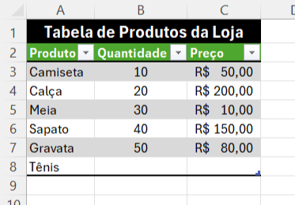
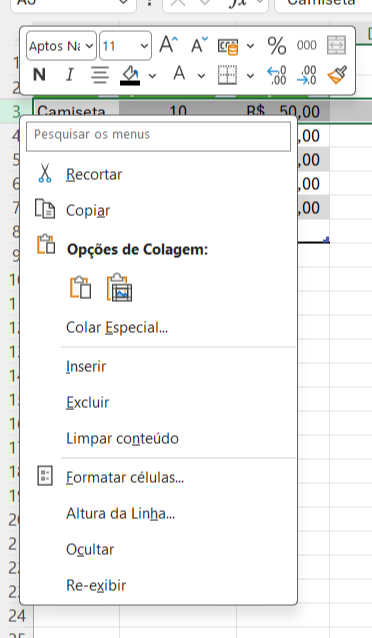
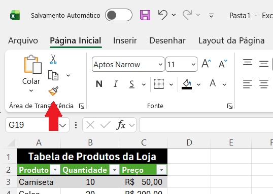

# Inserir e Organizar Dados em uma Tabela

> **Data:** 08 de setembro de 2026

Mostra como adicionar, inserir e excluir linhas e colunas em uma tabela já formatada.

---

### Adicionar dados automaticamente

Quando uma tabela foi criada utilizando o recurso Formatar como Tabela, o Excel reconhece sua estrutura.

- Ao inserir novos dados imediatamente abaixo da tabela, o Excel pode expandir automaticamente a tabela para incluir esses dados.
- Se houver uma ou mais linhas vazias entre a tabela e o novo dado, ele não será incorporado automaticamente à tabela.

Exemplo:

Se você escrever um novo produto logo abaixo de "Gravata", o Excel poderá expandir a tabela automaticamente.

---

## Inserir e excluir linhas

### Inserir uma nova linha

Para inserir uma linha no meio da tabela:

1. Clique com o botão direito sobre uma célula da linha onde deseja inserir.
2. Será aberto o menu de contexto.
3. Clique em Inserir.
4. Uma nova linha será criada na tabela.

A nova linha seguirá a formatação da tabela.

### Excluir uma linha

1. Clique com o botão direito sobre uma célula da linha que deseja excluir.
2. No menu de contexto, clique em Excluir.
3. A linha será removida da tabela.

---

## Inserir e excluir colunas

O mesmo princípio funciona para os cabeçalhos/colunas.

### Adicionar uma nova coluna

Ao inserir um novo dado ao lado de um cabeçalho existente, o Excel pode reconhecer a nova coluna e incorporá-la à tabela, aplicando automaticamente a formatação correspondente.

Também é possível criar uma coluna no meio da tabela:

1. Clique com o botão direito sobre uma célula da coluna desejada.
2. Abra o menu de contexto.
3. Clique em Inserir.
4. Uma nova coluna será criada, incluindo um novo cabeçalho e a formatação da tabela.

### Excluir uma coluna

1. Clique com o botão direito sobre uma célula da coluna.
2. Abra o menu de contexto.
3. Clique em Excluir.
4. A coluna será removida da tabela.

**OBS:** Ao inserir uma linha ou coluna dentro de uma tabela, o Excel mantém a estrutura e a formatação da tabela automaticamente.

---

## Pincel de Formatação

O Pincel de Formatação permite copiar apenas a formatação de uma área para outra, sem necessariamente copiar os dados.

📍 Ele fica na parte superior esquerda do Excel, na guia Página Inicial.

Como utilizar:
1. Selecione a célula ou área cuja formatação deseja copiar.
2. Clique no Pincel de Formatação 🖌️.
3. Selecione a célula ou área onde deseja aplicar a formatação.
4. A nova área receberá a mesma formatação.

Exemplo:
Se uma célula possui determinada fonte, tamanho, borda, preenchimento e alinhamento, o Pincel de Formatação permite aplicar esse mesmo estilo em outra célula.

### Como cancelar

Se você ativar o Pincel de Formatação sem querer, pressione Esc para cancelar.
