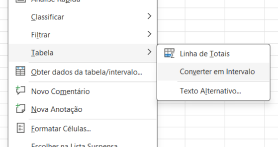

# Converter Tabela em Intervalo

> **Data:** 06 de outubro de 2026

---

## Tabela Formatada

Quando uma tabela foi criada utilizando `Formatar como Tabela`, pode ser necessário remover a estrutura de tabela, mas **manter os dados**.

Isso pode ser útil quando queremos apenas uma organização ou formatação simples, sem que o Excel continue tratando aquele intervalo como uma tabela.

### Limpar formatos × Converter intervalo

Ao utilizar `Limpar Formatos`, a formatação é removida, mas o Excel continua considerando o intervalo como uma tabela. 

Com isso, recursos da tabela, como os filtros, podem continuar presentes.

---

## Passo a passo

Como converter a tabela em intervalo:

1. Clique com o botão direito em qualquer célula da tabela.
2. No menu de contexto, procure a opção `Tabelas >`.
3. Clique em `Converter em Intervalo`.

4. Confirme clicando em `Sim`.

Os dados permanecem na planilha, mas o Excel deixa de considerar aquele intervalo como uma tabela. Os recursos específicos da tabela, como os filtros, são removidos.
